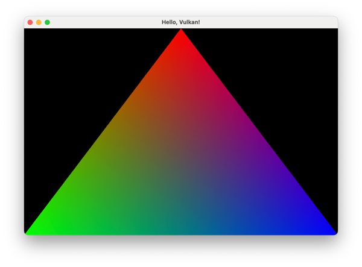

# B3. Core




**B3. Core** is a cross-platform framework that provides access and management of the main elements of a graphical application:

- events including mouse, keyboard and touchpad events,
- menus: application, context and etc.,
- windows,
- notifications,
- tray.

The framework was heavily inspired by [winit][winit] crate.

## Repository

If you want to make a **Pull Request** or open a new **Issue**, please, make sure that you are on [GitHub.com][github], and not project's mirrors.

**Main:**

- **GitHub**: <https://github.com/Klein-Stein/b3-core>

**Mirror:**

- **GitFlic**: <https://gitflic.ru/project/klein-stein/b3-core>

## Roadmap

- [x] **macOS:** Application menu support
- [x] **macOS:** Support of system events
- [x] **macOS:** Support of windows
- [x] **macOS:** Support of modal windows
- [x] **macOS:** Support of notifications

## Features

| Feature         | Description                             |
|:----------------|:----------------------------------------|
| `dh`            | Provide raw display and window pointers |
| `notifications` | Enable a support of user notifications  |

## Examples

The project contains few examples in the [examples](examples/) folder.

| Example         | Description                                               |
|:----------------|:----------------------------------------------------------|
| `hello-app`     | Minimally viable application with a trivial application menu. This example will only be visible on OS that supports the main application menu. |
| `hello-window`  | Example of application with multiple windows, notifications and the main application menu. |
| `hello-vulkan`  | Example of Vulkan initialization. It requires an additional configuration (see below). |

To launch the `hello-vulkan` example it's required to specify environment variables that point to installed Vulkan libraries. To do this, create `.env` file in project's root directory:

```sh
# Replace <...> by actual paths
cat <<EOT >> .env
VULKAN_SDK=<VULKAN_SDK_DIR>/<TARGET_PLATFORM_DIR>
PATH=<VULKAN_SDK_DIR>/<TARGET_PLATFORM_DIR>/bin:$PATH
DYLD_LIBRARY_PATH=<VULKAN_SDK_DIR>/<TARGET_PLATFORM_DIR>/lib:$DYLD_LIBRARY_PATH
VK_ICD_FILENAMES=<VULKAN_SDK_DIR>/<TARGET_PLATFORM_DIR>/share/vulkan/icd.d/MoltenVK_icd.json
VK_LAYER_PATH=<VULKAN_SDK_DIR>/<TARGET_PLATFORM_DIR>/share/vulkan/explicit_layer.d
EOT
```

## License

This project is distributed under the [MIT license][license].

[winit]:
https://github.com/rust-windowing/winit
[github]:
https://github.com
[license]:
LICENSE
